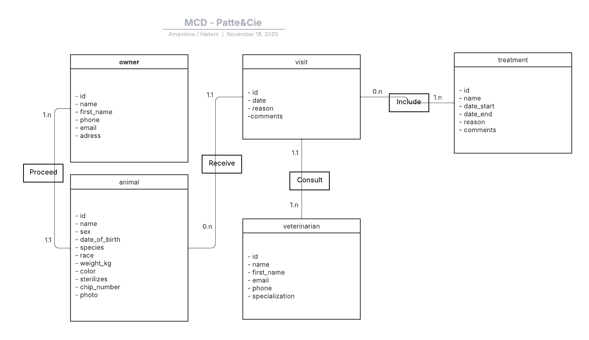

## MCD (MERISE)

### Relations

- Un **propriétaire** possède **1 à N animaux** (1,n)
- Un **animal** appartient à **1 propriétaire** (1,1)

- Un **animal** reçoit **0 à N visites** (0,n)
- Une **visite** concerne **1 animal** (1,1)

- Une **visite** est consultée par **1 vétérinaire** (1,n)
- Un **vétérinaire** consulte **N visites** (1,1)

- Une **visite** inclut **0 à N traitements** (0,n)
- Un **traitement** est inclus dans **1 visite** (1,n)

### Schéma MCD : 

